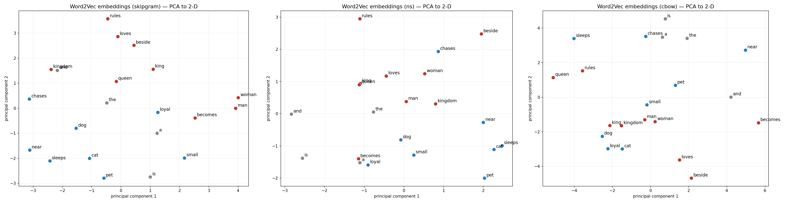
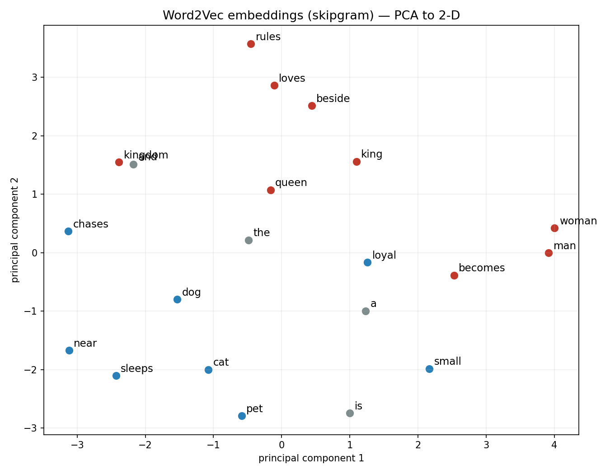
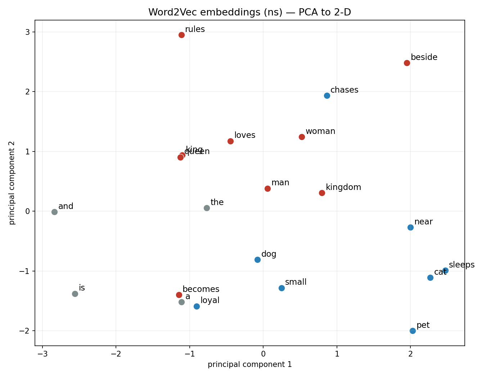
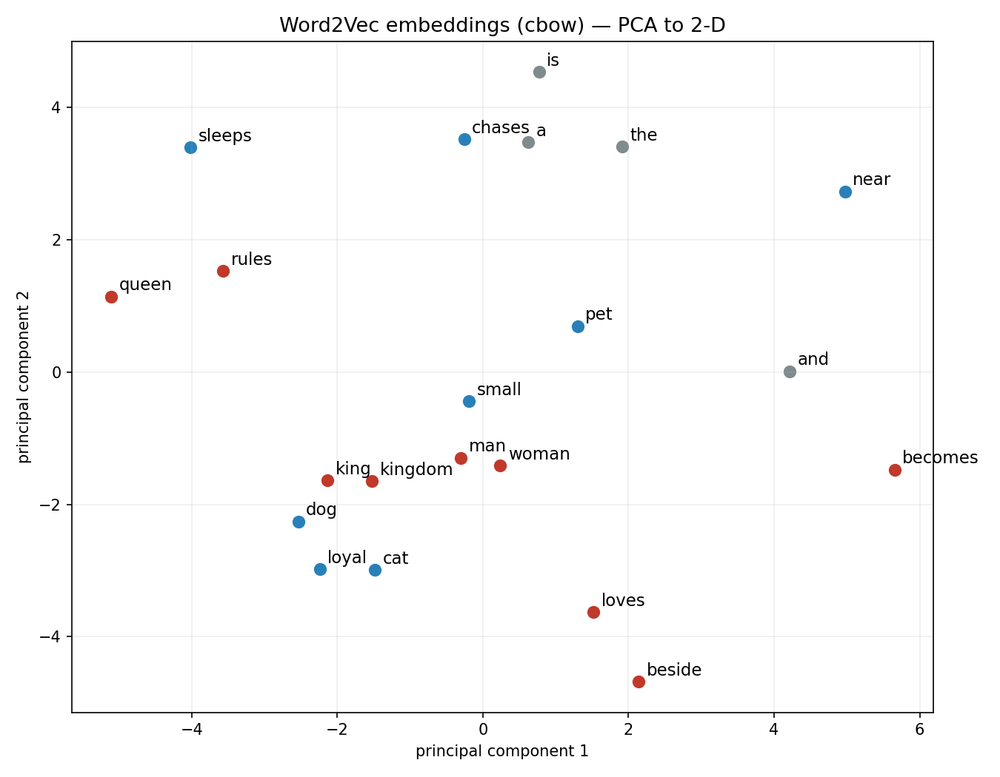

<div align="center">

# 🧠 Word2Vec from Scratch

### Skip-Gram · Negative Sampling · CBOW — built from first principles in pure PyTorch

*How machines learn the **meaning** of words, in ~200 lines of readable, heavily-commented code.*

[](https://www.python.org/)
[](https://pytorch.org/)
[](https://github.com/astral-sh/uv)
[](LICENSE)


<br/>



<sub><b>Three ways to learn word vectors, same toy corpus.</b> The model is never told that <i>king</i> and <i>queen</i> are related — yet the royalty cluster (red) and the pet cluster (blue) separate on their own, purely from co-occurrence. (16-D vectors → PCA → 2-D.)</sub>

</div>

---

## ✨ The idea in one line

> **You shall know a word by the company it keeps.**
> Train a tiny network to predict a word's neighbours — and the hidden layer it learns on the way *becomes* a map of meaning. Words used in similar contexts are forced to develop similar vectors.

Nothing about the spelling of `king` and `queen` is similar. Their *closeness* is learned entirely from the fact that they appear in similar surroundings. This repo makes that mechanism visible, end to end, with no black boxes.

---

## 🔭 Why this exists

Most engineers meet embeddings as an `import`. This project rebuilds them from the ground up so the intuition actually sticks:

- **No `gensim`, no pre-trained vectors, no magic** — every tensor is built by hand.
- **Shapes annotated at every step** — you can see exactly how text becomes integers becomes geometry.
- **Three canonical variants** sharing one clean core, so the *difference* between them is isolated to a single file each.
- **Runs in seconds on CPU.**

---

## 🧩 The pipeline

```
   raw text
      │  tokenize                      preprocess.py
      ▼
   token IDs  ──────────────────────  preprocess.py  (word_to_id / id_to_word)
      │  slide a window
      ▼
   (center, context) pairs  ────────  dataset.py
      │
      ▼
   SkipGram network  ───────────────  model.py   (nn.Embedding → nn.Linear)
      │  CrossEntropyLoss
      ▼
   trained word vectors  ───────────  train.py
      │  cosine similarity
      ▼
   nearest neighbours / 2-D plot ───  similarity.py · plot.py
```

---

## 🚀 Quickstart

```bash
# 1. clone
git clone https://github.com/atmaneayoubdev/word2vec-from-scratch.git
cd word2vec-from-scratch

# 2. environment (uv — fast, reproducible)
uv venv
uv pip install -r requirements.txt

# 3. train + inspect nearest neighbours
uv run python main.py          # Skip-Gram (softmax)
uv run python main_ns.py       # Skip-Gram + Negative Sampling
uv run python main_cbow.py     # CBOW

# 4. visualise the learned vectors in 2-D (saves a PNG)
uv run python plot.py          # skipgram   →  embeddings_skipgram.png
uv run python plot.py ns       # negative sampling
uv run python plot.py cbow     # CBOW
```

> Don't have `uv`? `pip install uv` — or swap in plain `python -m venv .venv` + `pip install -r requirements.txt`.

Every module is also runnable on its own to print the tensor shapes at that stage:

```bash
uv run python preprocess.py    # text → tokens → vocab → IDs
uv run python dataset.py       # (center, context) pairs + one batch
```

---

## 🧠 The three variants

| | **Skip-Gram** | **+ Negative Sampling** | **CBOW** |
|---|---|---|---|
| **Task** | center → predict each neighbour | center → real pair vs *K* fakes | average(context) → predict center |
| **Output layer** | `Linear(D, V)` + softmax | dot products, no softmax | `Linear(D, V)` + softmax |
| **Cost / example** | `O(V)` | **`O(K)`** | `O(V)` |
| **Scales to V = 1M?** | ❌ million-way softmax every step | ✅ *K* stays ~5–20 | ❌ |
| **Best at** | rare words, small corpora | large vocabularies | frequent words, speed |
| **Entry point** | [`main.py`](main.py) | [`main_ns.py`](main_ns.py) | [`main_cbow.py`](main_cbow.py) |

**The key insight behind negative sampling:** a full softmax asks *"which of all V words is the neighbour?"* — one expensive multi-class problem per step. Negative sampling reframes it as *"is this pair real, or one of K random noise words?"* — a handful of cheap binary decisions. Same vectors, but now it scales to real-world vocabularies. Negatives are drawn from the unigram distribution raised to the `0.75` power (the original paper's trick to dampen frequent words without over-sampling rare ones).

---

## 📊 Results

Trained on a tiny thematic corpus (royalty + pets), then queried by cosine similarity:

```text
most similar to 'king':  queen, woman, ...
most similar to 'cat':   pet, sleeps, near, ...
most similar to 'pet':   sleeps, near, cat, ...
```

| Skip-Gram | Negative Sampling | CBOW |
|:---:|:---:|:---:|
|  |  |  |

> ⚠️ **Read these honestly:** with a ~70-token toy corpus, the win of negative sampling is *computational*, not quality — at `V = 21` all three recover the clusters. PCA also keeps only the 2 highest-variance directions, so 2-D closeness is a faithful *summary*, not the full 16-D geometry. The point here is the *mechanism*, not benchmark numbers.

---

## 🗂️ Project structure

| File | Role |
|------|------|
| [`preprocess.py`](preprocess.py) | text → tokens → vocabulary (`word_to_id`, `id_to_word`) → token IDs |
| [`dataset.py`](dataset.py) | sliding window → `(center, context)` pairs → `Dataset` / `DataLoader` |
| [`model.py`](model.py) | `SkipGram`: `nn.Embedding` → `nn.Linear` |
| [`train.py`](train.py) | training loop with `CrossEntropyLoss` |
| [`similarity.py`](similarity.py) | cosine similarity / nearest-neighbour lookup |
| [`main.py`](main.py) | Skip-Gram pipeline, end to end |
| [`negative_sampling.py`](negative_sampling.py) | unigram^0.75 noise distribution + negative sampler |
| [`model_ns.py`](model_ns.py) | `SkipGramNS`: two embedding tables + the SGNS loss |
| [`train_ns.py`](train_ns.py) · [`main_ns.py`](main_ns.py) | negative-sampling trainer + pipeline |
| [`dataset_cbow.py`](dataset_cbow.py) | sliding window → `(context bag, center)` examples |
| [`model_cbow.py`](model_cbow.py) | `CBOW`: average context embeddings → predict center |
| [`train_cbow.py`](train_cbow.py) · [`main_cbow.py`](main_cbow.py) | CBOW trainer + pipeline |
| [`plot.py`](plot.py) | PCA the vectors to 2-D and scatter them |

---

## 🛣️ Roadmap

- [x] Skip-Gram with full softmax
- [x] Skip-Gram with Negative Sampling (SGNS)
- [x] CBOW
- [x] 2-D PCA visualisation
- [ ] Subsampling of frequent words
- [ ] Train on a larger real corpus + `king − man + woman ≈ queen` analogy demo

---

## 📚 References

- Mikolov et al., *Efficient Estimation of Word Representations in Vector Space* (2013)
- Mikolov et al., *Distributed Representations of Words and Phrases and their Compositionality* (2013) — negative sampling

---

<div align="center">
<sub>Built for learning. MIT licensed — fork it, break it, learn from it.</sub>
</div>
